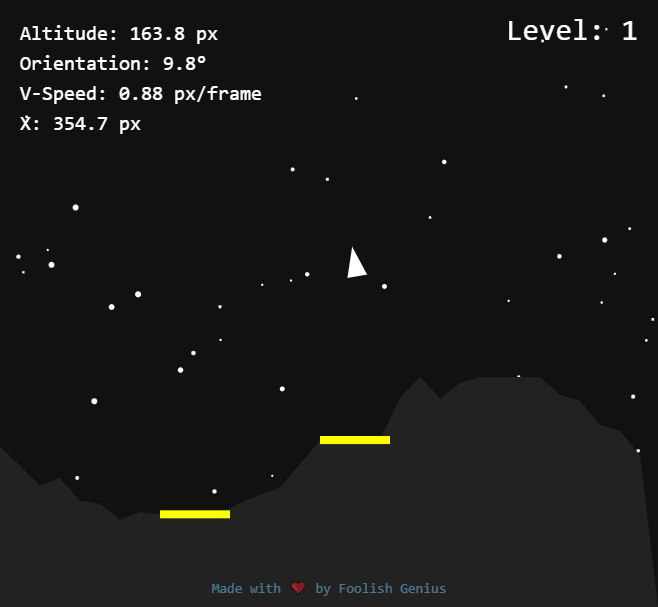

# 🌕 Moon Lander

A retro-style Moon Lander game built with JavaScript and HTML5 Canvas — no frameworks, just pure physics, particles, and pixel-perfect landings.

[🎮 Play Live](https://foolish-genius-moonlander.vercel.app/)
[Link 2](https://moon-lander.team-anant.com/)

---

## 🚀 Gameplay

Your mission: **land upright and gently** on yellow landing pads across procedurally generated lunar terrain.

### Controls

#### 🖥️ Keyboard
- `↑ Arrow` — Thrust
- `← / → Arrows` — Rotate
- `Enter / Space` — Start / Retry / Next Level

#### 📱 Touch (Mobile)
On-screen buttons appear during gameplay.

---

## ✨ Features

- Procedural terrain with increasing difficulty
- Realistic gravity, thrust, and rotation physics
- Particle-based flame and explosion effects
- Trajectory trail tracking
- Twinkling starfield background
- Sound effects: thrust, crash, landing
- Smooth animations and responsive canvas scaling
- Touch controls and mobile-friendly UI
- Levels increase terrain roughness & decrease pad size

---

## 🔧 Technologies

- HTML5 Canvas
- JavaScript (Vanilla)
- Audio API
- Responsive design (CSS)

---

## 📁 Project Structure
moon-lander/

├── index.html

├── style.css

├── main.js

├── sounds/

│ ├── rocketthrust.mp3

│ ├── rocket-landing.mp3

│ └── crash.mp3

└── README.md

# 🙌 Credits

Built by Foolish Genius

Sounds: Freesound
